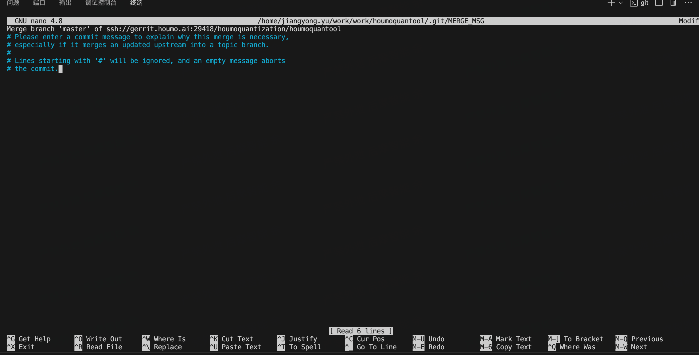

# Questions
## 1. git pull出现如下问题，按 ctrl+X退出 
## 2. nv的bt601 yuv和rgb的转换 
## 3. vscode debug时出现一串错误，但是能继续跑，这个大多数是由于参赛解析错误导致的，主要使用 ```pip install --upgrade importlib-metadata```可以解决
    ```shell
        usr/bin/env /home/jiangyong.yu/miniconda3/envs/qwen2vl/bin/python /home/jiangyong.yu/.vscode-server/extensions/ms-python.debugpy-2024.0.0-linux-x64/bundled/libs/debugpy/adapter/../../
    debugpy/launcher 49657 -- /home/jiangyong.yu/work/work/qwen2.5-vl/demo.py 
    E+00000.023: Error while enumerating installed packages.
                
                Traceback (most recent call last):
                File "/home/jiangyong.yu/.vscode-server/extensions/ms-python.debugpy-2024.0.0-linux-x64/bundled/libs/debugpy/adapter/../../debugpy/launcher/../../debugpy/common/log.py", line 361, in get_environment_description
                    report("    {0}=={1}\n", pkg.name, pkg.version)
                AttributeError: 'PathDistribution' object has no attribute 'name'
                
                Stack where logged:
                File "/home/jiangyong.yu/miniconda3/envs/qwen2vl/lib/python3.9/runpy.py", line 197, in _run_module_as_main
                    return _run_code(code, main_globals, None,
                File "/home/jiangyong.yu/miniconda3/envs/qwen2vl/lib/python3.9/runpy.py", line 87, in _run_code
                    exec(code, run_globals)
                File "/home/jiangyong.yu/.vscode-server/extensions/ms-python.debugpy-2024.0.0-linux-x64/bundled/libs/debugpy/adapter/../../debugpy/launcher/__main__.py", line 91, in <module>
                    main()
                File "/home/jiangyong.yu/.vscode-server/extensions/ms-python.debugpy-2024.0.0-linux-x64/bundled/libs/debugpy/adapter/../../debugpy/launcher/__main__.py", line 21, in main
                    log.describe_environment("debugpy.launcher startup environment:")
                File "/home/jiangyong.yu/.vscode-server/extensions/ms-python.debugpy-2024.0.0-linux-x64/bundled/libs/debugpy/adapter/../../debugpy/launcher/../../debugpy/common/log.py", line 369, in describe_environment
                    info("{0}", get_environment_description(header))
                File "/home/jiangyong.yu/.vscode-server/extensions/ms-python.debugpy-2024.0.0-linux-x64/bundled/libs/debugpy/adapter/../../debugpy/launcher/../../debugpy/common/log.py", line 363, in get_environment_description
                    swallow_exception("Error while enumerating installed packages.")
                File "/home/jiangyong.yu/.vscode-server/extensions/ms-python.debugpy-2024.0.0-linux-x64/bundled/libs/debugpy/adapter/../../debugpy/launcher/../../debugpy/common/log.py", line 215, in swallow_exception
                    _exception(format_string, *args, **kwargs)
                

    E+00000.016: Error while enumerating installed packages.
    ```